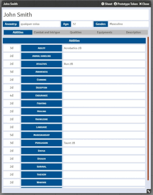
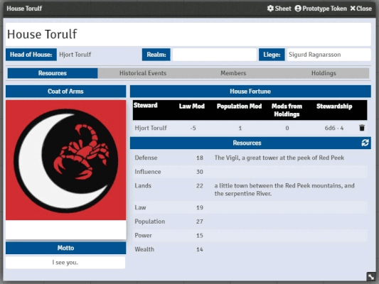
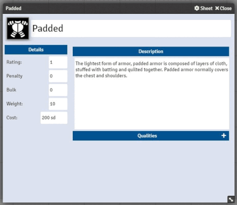

# Chronicle System (Unofficial) for Foundry VTT

This is a fan-created implementation of **Green Ronin's Chronicle System** for **Foundry VTT**, this system is used in Swords Chronicle RPG and Song of Ice and Fire RPG. 

It currently has one functional character sheet with the following characteristics:
- Rollable test values
- Armor's bulk and penalty values influencing the character
- Support to Sorcery rules
- Support to ASoIaF Armor penalty (see Settings)
- Fatigue, Frustration, Stress, Injury, and Wound values affect the character's rolls (although the Ability tab still shows the basic abilities values)
- Weapon and armor states change between equipped or not, offhand or not (although I still need to work on adaptable weapons)

And a House Sheet:
- With random resources generation (optional)
- Historical Events information and modifiers (already applied to the displayed value of resources)
- Links to created characters, with their proper positions in the house.
- Information about all holdings (except units) invested by the house.
- House fortune rolls.

Some of the future implementations include:
- To Character Sheet
  - Create a system for items and qualities in which, when registered, they already define their modifiers and penalties.
- To House Sheet
  - Create the House Units actors and yours sheets.
  - Add a field to character investments points to House Resources.
  - Add Holding benefits automations to House.
- improve the layout and show more information for the dice roll in chat.
- implement the initiatives for the different types of interactions, currently no Initiative is implemented.
- implement localization in the system, currently it is only in English and only works with items (qualities, skills, etc) in English
- among others (feel free to request new features in the Issues tab of Git Hub)

## How to Create a Weapon

The main things to know about create a weapon are:
- the **specialty** must be set to the pattern: **Ability:Specialty**, *e.g. Fighting:Axes*
- the **damage** must be informed in the format: **@Ability(+-\*/)number**, *eg: @Athletics+1*

*P.s.: for now, for the automations to work, everything needs to be registered in English, both the qualities of weapons and armor, as well as abilities and their specialties.*

## Credits
Although, for now, I'm making the system myself, I've been looking for a lot of inspiration (sometimes I've even copied it, sorry for that) in other existing systems, like **Cyberpunk Red Core**, **Burning Wheel** and **GURPS 4th Ed Game Aid**